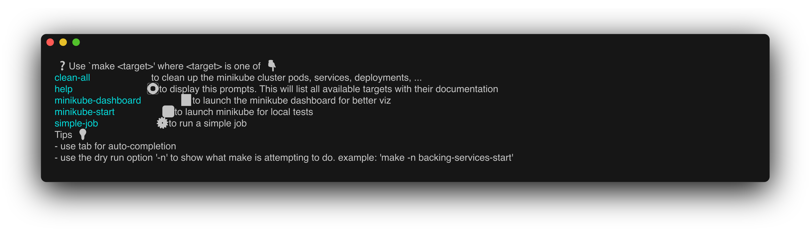

# Préparation certif' CKAD

- [Préparation certif' CKAD](#préparation-certif-ckad)
  - [Quelques commandes](#quelques-commandes)
    - [Pré-requis](#pré-requis)
  - [Define and build image](#define-and-build-image)
  - [Jobs \& cronjobs](#jobs--cronjobs)
    - [Pointeurs de docs utiles et autorisés le jour J](#pointeurs-de-docs-utiles-et-autorisés-le-jour-j)

## Quelques commandes

### Pré-requis

- 🥏 [Kubectl](https://kubernetes.io/fr/docs/tasks/tools/install-kubectl/)
- 🚐 [Minikube](https://kubernetes.io/fr/docs/tasks/tools/install-minikube/)
- 🐳 Docker ou [Colima](https://github.com/abiosoft/colima)
- ⚙️ make (>v4)
- 🧊 [charmbracelet/freeze](https://github.com/charmbracelet/freeze)

## Define and build image

- Pour save une image : `$> docker save ckad:docker --output ckad.tar`
- Pour save & compresser une image : `$> docker save ckad:docker | gzip > image .tar.gz`
- Créer une image à partir d'une image trifouillée : `$> docker commit <container> <new_image>`
- Renommer une image : `$> docker image tag ckad:docker mho/ckad:docker`
- Détruire une image s'il n'y a pas de container associé qui tourne : `$> docker image rm <image>`

> [!TIP]
> Pour aller + loin : <https://github.com/nigelpoulton/ckad>

## Jobs & CronJobs

>[!Warning]
> Il peut arriver qu'on nous demande de se positionner dans un namespace précis pour faire des actions, mais sans nous dire comment faire :
>
> `$> kubectl config set-context --curent --namespace=<ns>;`

| Kind    | Spec                    | ?                                         |
| ------- | ----------------------- | ----------------------------------------- |
| Job     | completions             | Combien de pods on veut lancer            |
| Job     | parallelism             | Combien de pods peuvent être lancés en // |
| Job     | backoffLimit            | Combien de retry (exponentiel) max        |
| CronJob | startingDeadlineSeconds | Deadline avant laquelle lancer le job     |

> [!Warning]
> Si startingDeadlineSeconds est inférieur à 10, le Cronjob risque de ne jamais démarrer, car le CronJobController vérifie toutes les 10 secondes si un nouveau job a été déclaré

### Pointeurs de docs utiles et autorisés le jour J

- <https://kubernetes.io/docs/concepts/workloads/controllers/job/>
- <https://kubernetes.io/docs/reference/kubernetes-api/workload-resources/job-v1/>
- <https://kubernetes.io/docs/concepts/workloads/controllers/cron-jobs/>
- <https://kubernetes.io/docs/reference/kubernetes-api/workload-resources/cron-job-v1/>
