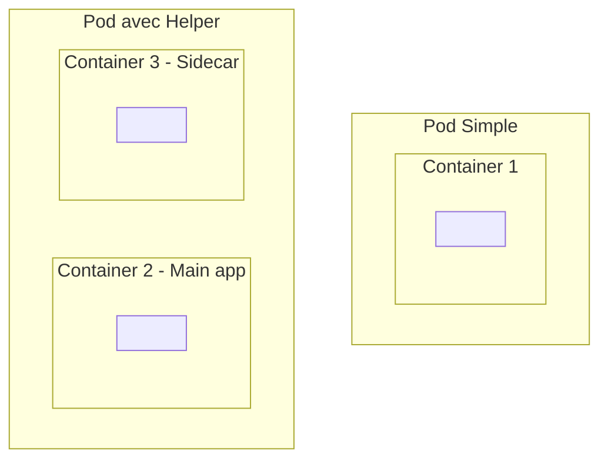
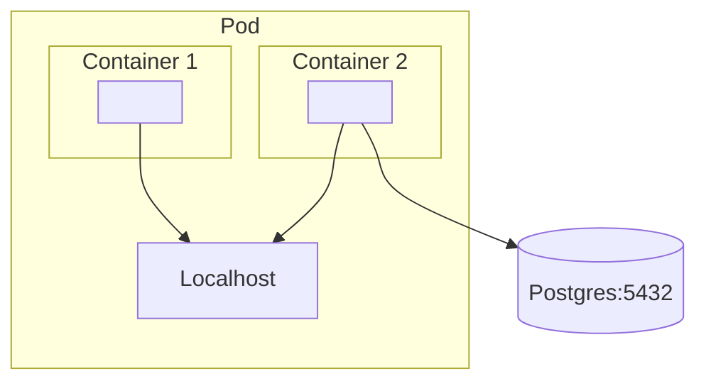
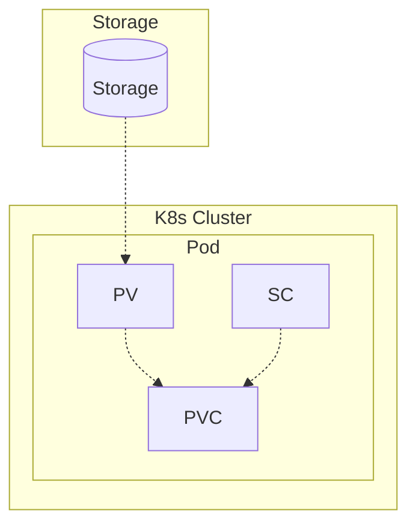

# Préparation certif' CKAD

- [Préparation certif' CKAD](#préparation-certif-ckad)
  - [Quelques commandes](#quelques-commandes)
    - [Pré-requis](#pré-requis)
  - [Ressources pour se former](#ressources-pour-se-former)
  - [Des commandes utiles en vrac ❗️](#des-commandes-utiles-en-vrac-️)
    - [Pointeurs de doc autorisés pendant la certif'](#pointeurs-de-doc-autorisés-pendant-la-certif)
  - [Define and build image](#define-and-build-image)
  - [Jobs \& CronJobs](#jobs--cronjobs)
    - [Pour s'exercer](#pour-sexercer)
  - [Multi-container pods](#multi-container-pods)
    - [Ambassador pattern](#ambassador-pattern)
      - [Use case](#use-case)
    - [Adapter pattern](#adapter-pattern)
      - [Use case : transformation vers un puits de logs](#use-case--transformation-vers-un-puits-de-logs)
    - [Init pattern](#init-pattern)
    - [Autres pointeurs](#autres-pointeurs)
  - [Utilise persistent \& ephemeral volumes](#utilise-persistent--ephemeral-volumes)

## Quelques commandes

### Pré-requis

- 🥏 [Kubectl](https://kubernetes.io/fr/docs/tasks/tools/install-kubectl/)
- 🚐 [Minikube](https://kubernetes.io/fr/docs/tasks/tools/install-minikube/)
- 🐳 Docker ou [Colima](https://github.com/abiosoft/colima)
- ⚙️ make (>v4)
- 🧊 [charmbracelet/freeze](https://github.com/charmbracelet/freeze)

## Ressources pour se former

- Cours Pluralsight [Certified Kubernetes Application Developer: Application Design and Build](https://app.pluralsight.com/library/courses/ckad-services-networking-cert/table-of-contents) de [Nigel Poulton](https://www.nigelpoulton.com/)
- Pages officielles du CNCF sur le contenu de l'examen :
  - ℹ️ A propos : <https://www.cncf.io/training/certification/ckad/>
  - 📖 Certificate handbook : <https://docs.linuxfoundation.org/tc-docs/certification/lf-handbook2>
  - 💡 Exam tips : <https://docs.linuxfoundation.org/tc-docs/certification/tips-cka-and-ckad>
  - ❓ FAQ : <https://docs.linuxfoundation.org/tc-docs/certification/faq-cka-ckad-cks>
  - 🎲 Cheatsheet : <https://kubernetes.io/docs/reference/kubectl/quick-reference/>

## Des commandes utiles en vrac ❗️

| Use case                                       | Commandes                                                                           |
| ---------------------------------------------- | ----------------------------------------------------------------------------------- |
| Pour se connecter à un namespace               | `$> kubectl config set-context --current --namespace=<insert-namespace-name-here>;` |
| Pour voir les logs d'un pod                    | `$> kubectl logs <pod-id>;`                                                         |
| Si pas ou pas assez de logs                    | `$> kubectl describe pod <pod-id>`                                                  |
| Editer un pod pour lequel on n'a pas de config | `$> kubectl get pod <pod-name> -o yaml > pod-definition.yaml`                       |
| Editer un pod                                  | `$> kubectl edit pod <pod-name>`                                                    |

### Pointeurs de doc autorisés pendant la certif'

- <https://kubernetes.io/docs/concepts/workloads/controllers/job/>
- <https://kubernetes.io/docs/reference/kubernetes-api/workload-resources/job-v1/>
- <https://kubernetes.io/docs/concepts/workloads/controllers/cron-jobs/>
- <https://kubernetes.io/docs/reference/kubernetes-api/workload-resources/cron-job-v1/>

## Define and build image

- Pour save une image : `$> docker save ckad:docker --output ckad.tar`
- Pour save & compresser une image : `$> docker save ckad:docker | gzip > image .tar.gz`
- Créer une image à partir d'une image trifouillée : `$> docker commit <container> <new_image>`
- Renommer une image : `$> docker image tag ckad:docker mho/ckad:docker`
- Détruire une image s'il n'y a pas de container associé qui tourne : `$> docker image rm <image>`

> [!TIP]
> Pour aller + loin : <https://github.com/nigelpoulton/ckad>

## Jobs & CronJobs

>[!Warning]
> Il peut arriver qu'on nous demande de se positionner dans un namespace précis pour faire des actions, mais sans nous dire comment faire :
>
> `$> kubectl config set-context --curent --namespace=<ns>;`

| Kind    | Spec                    | ?                                                  |
| ------- | ----------------------- | -------------------------------------------------- |
| Job     | parallelism             | Combien de pods peuvent être lancés en //          |
| Job     | completions             | Combien de pods on veut lancer                     |
| Job     | backoffLimit            | Stop attempting retries after N tries              |
| Job     | backoffLimit            | Combien de retry (exponentiel) max                 |
| Job     | activeDeadlineSeconds   | Terminate job if it still runnning after N seconds |
| CronJob | startingDeadlineSeconds | Deadline avant laquelle lancer le job              |
| CronJob | concurrencyPolicy       | Allow x Forbid x Replace                           |

> [!Warning]
> Si startingDeadlineSeconds est inférieur à 10, le Cronjob risque de ne jamais démarrer, car le CronJobController vérifie toutes les 10 secondes si un nouveau job a été déclaré

### Pour s'exercer

> [!Tip]
> Des exercices/Q&A dispo sur ce topic ici :
> 🔗 <https://github.com/nigelpoulton/ckad/blob/main/1%20Application%20Design%20and%20Build/3%20Understand%20Jobs%20and%20CronJobs/answers.md>

## Multi-container pods

### Ambassador pattern

> [!INFO]
> The ambassador container runs alongside the app container for as long as the pod runs, so neither of those containers completes or terminate until the app is actually finished

#### Use case

- Décorréler la responsabilité de se connecter à la db
  - L'app n'a pas besoin de savoir joindre la db
  - L'app tape sur localhost:5432
  - Le sidecar intercepte la connexion sur ce port et relais à la db
  - Le sidecar prend la responsabilité de connaître l'environnement hors du pod

### Adapter pattern

> [!INFO]
> L'Adapter agit comme un conteneur de transformation qui facilite la communication entre le conteneur principal et un service externe

#### Use case : transformation vers un puits de logs

```mermaid
graph LR
    subgraph "Pod"
        subgraph "Container 1"
            App["<App>"]
        end
        subgraph "Container 2"
            Adapter["<Adapter>Convert X → Y"]
        end
        FormatX[("Format: X")]
        App --- FormatX
        Adapter --- FormatX
    end
    
    FormatY[("Format: Y")]
    Adapter --> FormatY
```

### Init pattern

```mermaid
graph TD
    subgraph "Pod FE"
        subgraph "Container 1"
            FE["FE App"]
        end
        subgraph "Container 2 - sidecar"
            Init["Init"]
        end
    end
    
    subgraph "Pod BE"
        subgraph "Container 3"
            BE["BE App"]
        end
    end
    
    Init --> BE
    
    %% Lignes pointillées pour les annotations
    FE -.- A["App starts after init containers"]
    Init -.- B["Init containers run before app containers"]
```

ℹ️ Dans ce schéma: FE=frontend, BE=backend

- Les `initContainers` se déclarent en conf de `Pod.spec`
- Sous la forme d'une liste
- On peut en avoir plusieurs
- Ils se run dans l'ordre de déclaration dans la liste
- Un initContainer ne lance que 1 fois
- Les containers ne se lancent que lors tous les init containers ont terminé leur job avec succès ✅

> [!NOTE]
>
> - Les sidecar adapter et ambassador vivent aussi longtemps que les containers qu'ils accompagnent
> - Les initContainers doivent se terminer pour que les containers "principaux" se lancent

### Autres pointeurs

- Ambassador : <https://learncloudnative.com/blog/2020-10-03-ambassador-pattern>

## Utilise persistent & ephemeral volumes

On manipule 3 abstractions principalement ici :

| Abstraction                 | Rappel                                                                                |
| --------------------------- | ------------------------------------------------------------------------------------- |
| EphemeralVolume             | Pour de la donnée temporaire, du cache, ...                                           |
| PersistentVolume (PV)       | Pour créer un volumen persistent, pour de la data qu'on ne veut pas perdre            |
| PersistentVolumeClaim (PVC) |                                                                                       |
| StorageClass (SC)           | Définition d'une classe de stockage utilisable dans un cluster, référencée par un PVC |

