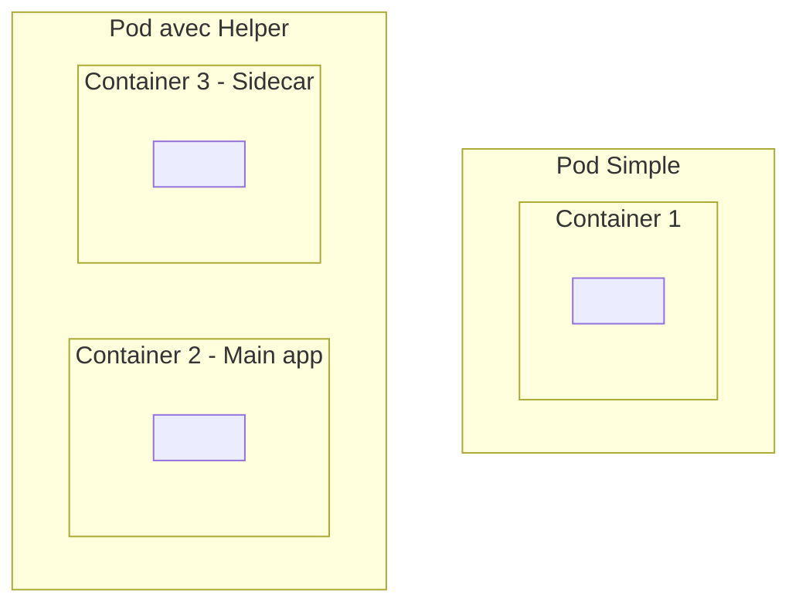
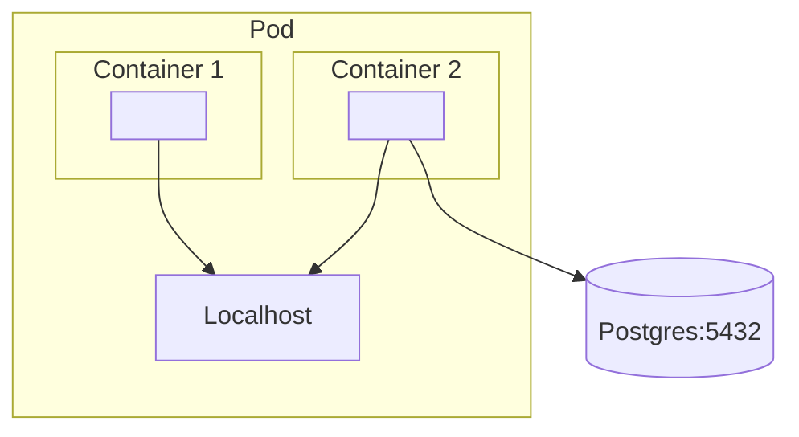
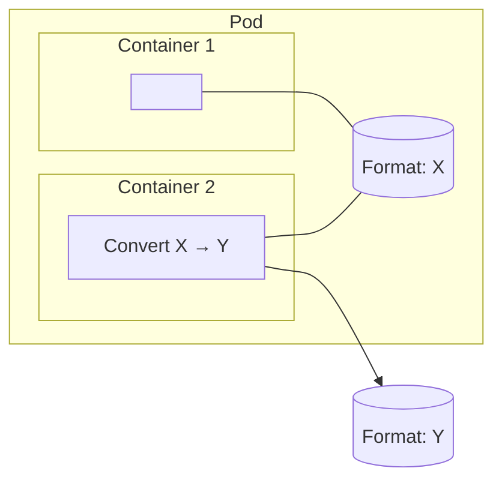
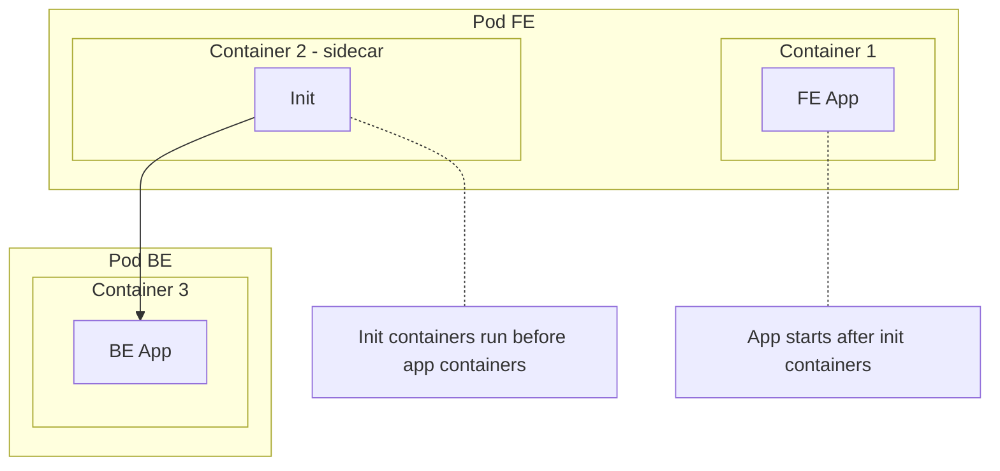
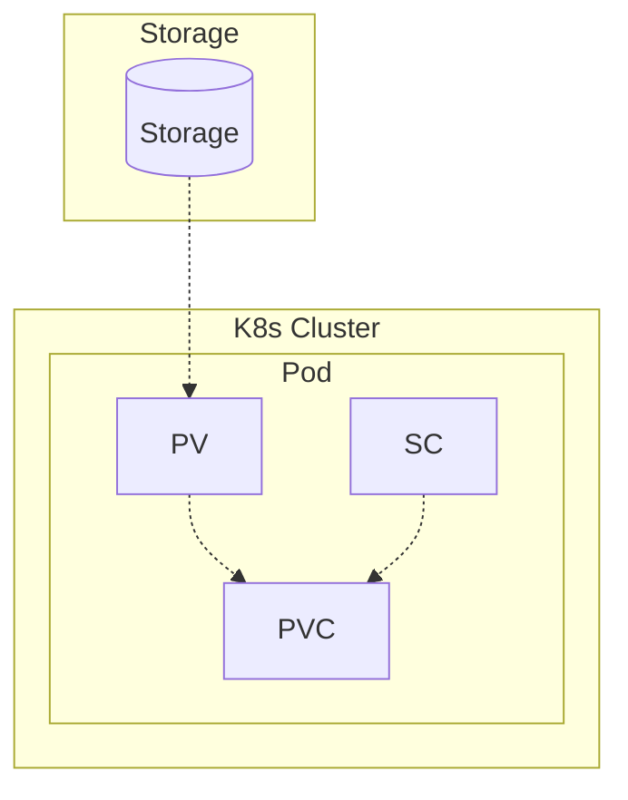

# Define and build image

- [Define and build image](#define-and-build-image)
  - [Jobs \& CronJobs](#jobs--cronjobs)
    - [Pour s'exercer](#pour-sexercer)
  - [Multi-container pods](#multi-container-pods)
    - [Ambassador pattern](#ambassador-pattern)
      - [Use case](#use-case)
    - [Adapter pattern](#adapter-pattern)
      - [Use case : transformation vers un puits de logs](#use-case--transformation-vers-un-puits-de-logs)
    - [Init pattern](#init-pattern)
    - [Autres pointeurs](#autres-pointeurs)
  - [Utilise persistent \& ephemeral volumes](#utilise-persistent--ephemeral-volumes)

- Pour save une image : `$> docker save ckad:docker --output ckad.tar`
- Pour save & compresser une image : `$> docker save ckad:docker | gzip > image .tar.gz`
- Créer une image à partir d'une image trifouillée : `$> docker commit <container> <new_image>`
- Renommer une image : `$> docker image tag ckad:docker mho/ckad:docker`
- Détruire une image s'il n'y a pas de container associé qui tourne : `$> docker image rm <image>`

> [!TIP]
> Pour aller + loin : <https://github.com/nigelpoulton/ckad>

## Jobs & CronJobs

>[!Warning]
> Il peut arriver qu'on nous demande de se positionner dans un namespace précis pour faire des actions, mais sans nous dire comment faire :
>
> `$> kubectl config set-context --curent --namespace=<ns>;`

| Kind    | Spec                    | ?                                                  |
| ------- | ----------------------- | -------------------------------------------------- |
| Job     | parallelism             | Combien de pods peuvent être lancés en //          |
| Job     | completions             | Combien de pods on veut lancer                     |
| Job     | backoffLimit            | Combien de retry (exponentiel) max                 |
| Job     | activeDeadlineSeconds   | Terminate job if it still runnning after N seconds |
| CronJob | startingDeadlineSeconds | Deadline avant laquelle lancer le job              |
| CronJob | concurrencyPolicy       | Allow x Forbid x Replace                           |

> [!Warning]
> Si `startingDeadlineSeconds` est inférieur à 10, le Cronjob risque de ne jamais démarrer, car le CronJobController vérifie toutes les 10 secondes si un nouveau job a été déclaré

### Pour s'exercer

> [!Tip]
> Des exercices/Q&A dispo sur ce topic ici :
> 🔗 <https://github.com/nigelpoulton/ckad/blob/main/1%20Application%20Design%20and%20Build/3%20Understand%20Jobs%20and%20CronJobs/answers.md>

## Multi-container pods

### Ambassador pattern

> [!INFO]
> The ambassador container runs alongside the app container for as long as the pod runs, so neither of those containers completes or terminate until the app is actually finished

#### Use case

- Décorréler la responsabilité de se connecter à la db
  - L'app n'a pas besoin de savoir joindre la db
  - L'app tape sur localhost:5432
  - Le sidecar intercepte la connexion sur ce port et relais à la db
  - Le sidecar prend la responsabilité de connaître l'environnement hors du pod

### Adapter pattern

> [!INFO]
> L'Adapter agit comme un conteneur de transformation qui facilite la communication entre le conteneur principal et un service externe

#### Use case : transformation vers un puits de logs

### Init pattern

ℹ️ Dans ce schéma: FE=frontend, BE=backend

- Les `initContainers` se déclarent en conf de `Pod.spec`
- Sous la forme d'une liste
- On peut en avoir plusieurs
- Ils se run dans l'ordre de déclaration dans la liste
- Un initContainer ne lance que 1 fois
- Les containers ne se lancent que lors tous les init containers ont terminé leur job avec succès ✅

> [!NOTE]
>
> - Les sidecar adapter et ambassador vivent aussi longtemps que les containers qu'ils accompagnent
> - Les initContainers doivent se terminer pour que les containers "principaux" se lancent

### Autres pointeurs

- Ambassador : <https://learncloudnative.com/blog/2020-10-03-ambassador-pattern>

## Utilize persistent & ephemeral volumes

On manipule 3 abstractions principalement ici :

| Abstraction                 | Rappel                                                                                |
| --------------------------- | ------------------------------------------------------------------------------------- |
| EphemeralVolume             | Pour de la donnée temporaire, du cache, ...                                           |
| PersistentVolume (PV)       | Pour créer un volume persistent, pour de la data qu'on ne veut pas perdre            |
| PersistentVolumeClaim (PVC) |                                                                                       |
| StorageClass (SC)           | Définition d'une classe de stockage utilisable dans un cluster, référencée par un PVC |

