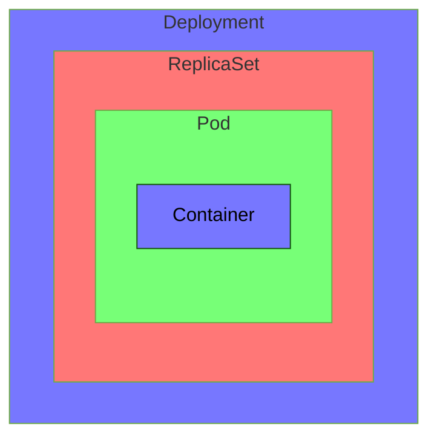
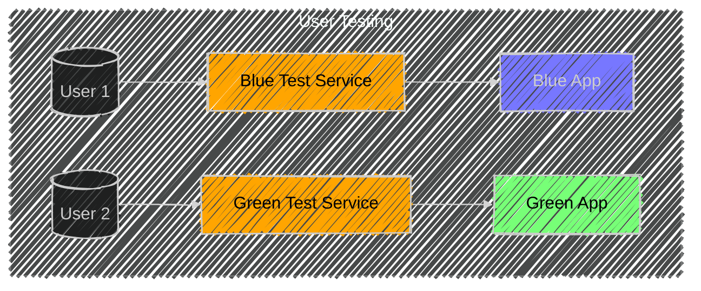

# Application Deployment

> [!NOTE]
> Focus sur 
> * 🚀🚀 les `deployment`, 
> * 🔵🟢 le `blue/green` déploiement,
> * 🚀🐥le `canary` déploiement.

## Primitives k8s pour déployer

* Principales abstractions : le `deployment` et les `replicaSet`

> [!TIP]
> On peut générer la déclaration d'un `deployment` en CLI pour éviter de chercher ça dans la doc le jour J :
> 
> `$> kubectl create deployment nginx --image nginx:alpine --dry-run=client -o yaml > nginx-deploy.yaml;`

> [!NOTE]
> La plupart des exercices vont nous demander d'éditer un `deployment` qui tourne déjà
> Il faut être à l'aise avec les commandes :
> * `kubectl scale`
> * `kubectl edit`
> * `kubectl set`
> * `kubectl create/apply`

## 🔵🟢 Blue/Green deployment

* Principales abstractions : le `deployment`, les `replicaSet` et les `services`

> [!TIP]
> Approche impérative :
> 
> `$> kubectl set selector svc [service-name] 'role=green'; # (was 'blue')`

💡 Un exemple de setup blue/green/public `service` pour faire du blue/green deployment [est dispo ici, sur le repo de npoulton](https://github.com/nigelpoulton/ckad/tree/main/2%20Application%20Deployment/2%20Use%20Kubernetes%20Primitives%20to%20Implement%20Common%20Deployment%20Strategies/Blue-Green)

🖼️ Y a ce schéma aussi qui est pas mal pour illustrer : ([crédits Anvesh Muppeda sur Medium](https://medium.com/@muppedaanvesh/blue-green-deployment-in-kubernetes-76f9153e0805)) :

