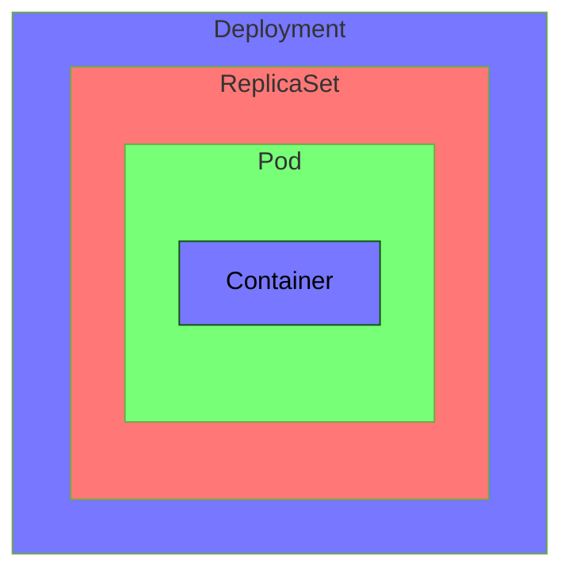
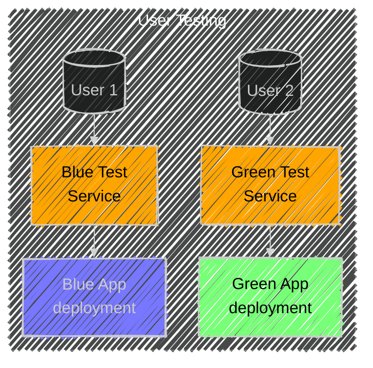
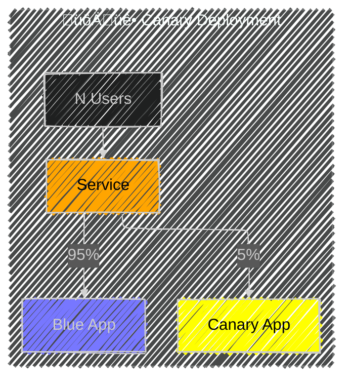

# Application Deployment

> [!NOTE]
> Focus sur 
> * üöÄüöÄ les `deployment`, 
> * 🔵🟢 le `blue/green` déploiement,
> * 🚀🐥le `canary` déploiement.

## Primitives k8s pour déployer

* Principales abstractions : le `deployment` et les `replicaSet`

```mermaid
%%{init: {'theme':'forest'}}%%
graph TD
    subgraph Deployment
        subgraph ReplicaSet
            subgraph Pod
                Container["Container"]
            end
        end
    end
style Deployment fill:#77F
style ReplicaSet fill:#F77
style Pod fill:#7F7
style Container fill:#77F
```

> [!TIP]
> On peut générer la déclaration d'un `deployment` en CLI pour éviter de chercher ça dans la doc le jour J :
> 
> `$> kubectl create deployment nginx --image nginx:alpine --dry-run=client -o yaml > nginx-deploy.yaml;`

> [!NOTE]
> La plupart des exercices vont nous demander d'éditer un `deployment` qui tourne déjà
> Il faut être à l'aise avec les commandes :
> * `kubectl scale`
> * `kubectl edit`
> * `kubectl set`
> * `kubectl create/apply`

## 🔵🟢 Blue/Green deployment

* Principales abstractions : le `deployment`, les `replicaSet` et les `services`

```mermaid
---
config:
  layout: elk
  look: handDrawn
  theme: dark
  mainBkg: #f4f4f4
---
graph TD
    subgraph "User Testing"
        User1[("User 1")] --> BlueTest["Blue Test <br>Service"]
        User2[("User 2")] --> GreenTest["Green Test <br>Service"]
        
        BlueTest --> BlueApp["Blue App <br>deployment"]
        GreenTest --> GreenApp["Green App <br>deployment"]
    end
style BlueTest fill:orange,color:black
style GreenTest fill:orange,color:black
style BlueApp fill:#77F
style GreenApp fill:#7F7,color:black
```

> [!TIP]
> Approche impérative :
> 
> `$> kubectl set selector svc [service-name] 'role=green'; # (was 'blue')`

üí° Un exemple de setup blue/green/public `service` pour faire du blue/green deployment [est dispo ici, sur le repo de npoulton](https://github.com/nigelpoulton/ckad/tree/main/2%20Application%20Deployment/2%20Use%20Kubernetes%20Primitives%20to%20Implement%20Common%20Deployment%20Strategies/Blue-Green)

🖼️ Y a ce schéma aussi qui est pas mal pour illustrer : ([crédits Anvesh Muppeda sur Medium](https://medium.com/@muppedaanvesh/blue-green-deployment-in-kubernetes-76f9153e0805)) :

## üöÄüê• Canary deployment

> [!INFO]
> *Canary deployment strategy involves deploying new versions of applications next to stable production versions to see how the canary version compares against the baseline before promoting or rejecting the deployment*  -- [*Microsoft*](https://learn.microsoft.com/en-us/azure/devops/pipelines/ecosystems/kubernetes/canary-demo?view=azure-devops&tabs=yaml#:~:text=A%20canary%20deployment%20strategy%20deploys,or%20reject%20the%20canary%20deployment.)

```mermaid
---
config:
  layout: elk
  look: handDrawn
  theme: dark
  mainBkg: #f4f4f4
---
graph TD
    subgraph "üöÄüê• Canary Deployment"
        Users["N Users"] --> Service["Service"]
        
        Service --95%--> BlueApp["Blue App"]
        Service --5%--> CanaryApp["Canary App"]
    end
style Service fill:orange,color:black
style BlueApp fill:#77F
style CanaryApp fill:yellow,color:black
```

Démarche :

1. on vérifie que la nouvelle release fonctionne bien en production avec le minimum de trafic nécessaire pour la valider
2. si c'est good, la canary release devient la nouvelle *stable release* et absorbe tout le trafic
